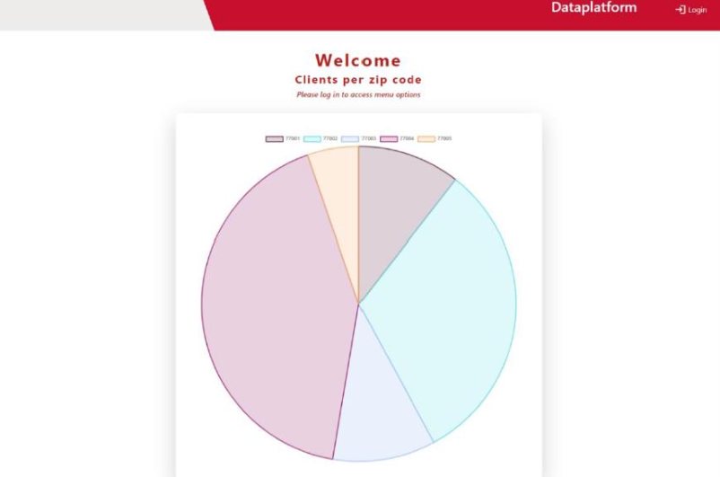

# Enterprise Data Platform Project
## Project Overview
The application, originally developed by previous students as a prototype, is a data platform designed to simulate how Community Health Workers (CHWs) might organize events, collect client data, and facilitate sign-ups for various services. This project expands upon the existing codebase by introducing new features and refining the application to demonstrate better maintainability and usability in a real-world scenario. 
- Key technologies: **MEVN Stack** (MongoDB, Express, Vue.js, Node.js).

## Scope and Features
### Key Enhancements
1. **Transition to the Composition API**:
   - Refactor the codebase from the Vue Options API to the Composition API for improved maintainability and code organization.
2. **User Authentication and Role-Based Access Control**:
   - Implement secure login functionality with hashed password storage.
   - Role-based access control for two roles: Viewers and Editors.
   - Tailor UI to dynamically display options based on user roles.
3. **Integration of Services at the Data Layer**:
   - Add CRUD functionality for managing event services.
   - Replace hardcoded service data with a dynamic system.
   - Extend API endpoints for real-time service updates.
4. **Dashboard Enhancement with Visualization**:
   - Add Pie or Doughnut charts to visualize client distribution by zip code.
   - Dynamically fetch and display data from API endpoints.

## Deliverables
### Functional Deliverables
- Secure user authentication and authorization.
- Service management features for CRUD operations.
- Enhanced dashboard with dynamic data visualization.

### UI Deliverables
- User-friendly login page and navigation elements.
- Service management pages with intuitive forms.
- Chart components for dashboard visualization.

### Documentation
- Use case diagrams for core features.
- User flow diagrams for authentication and event services.
- Timeline and project schedule for development milestones.

## Team Members
The current iteration is based on development done by:
- Joanna Macedo, Trinity Klein, and Maria Abejide in Spring 2024
- Jeremy Griffith and Edwin Charly in Spring of 2023
- Elliot Farmer Garcia, Agatha Molski, and Chris Blanco in the Fall of 2022.
  
## Getting Started
### Data Platform Project Setup
#### Backend Node Application
```
cd backend
```
Follow instructions in the backend README for setup and running as a local instance.

#### Frontend Vue 3 Application
```
cd frontend
```
Follow instructions in frontend README for setup and running as a local instance.

---

## Vue.js Projects
### Form App: 
- This project is a simple form application built using **Vue.js**, **HTML**, and **JavaScript**. It allows users to interact with various facilities, toggle items, and calculate a total cost based on user selections. The app also ensures proper currency formatting in USD($).

### MongoDB Exercises
- This folder contains a series of exercises designed to help users practice basic MongoDB operations such as creating databases, inserting documents, querying collections, and using advanced query operators. The exercises include screenshots and explanations to guide users through each task.
