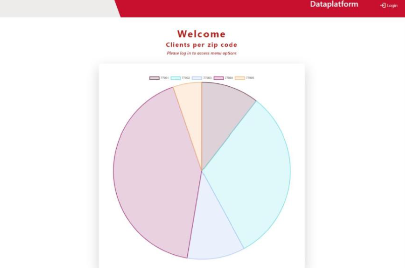

# Enterprise Data Platform Project



## Project Overview

This project is a full-stack data platform (MEVN) that models how Community Health Workers (CHWs) manage events, client data, and service sign-ups. This iteration refactors a prototype into a maintainable, production-minded application with role-based access, dynamic service management, and interactive visualizations.

This project transformed an academic prototype into a production-ready data platform by addressing maintainability, security, and real-world usability gaps. The frontend was refactored to the Vue Composition API to improve code organization and extensibility, while secure authentication with role-based access control enabled differentiated Viewer and Editor workflows. Static service data was replaced with fully dynamic CRUD-backed APIs, and interactive dashboard visualizations were added to surface actionable client and event metrics. 

The result is a more maintainable, extensible, and analytics-driven application aligned with real-world Community Health Worker workflows. 

## Team

- Joanna Macedo - Contributor  
- Trinity Klein - Contributor  
- Maria Abejide - Contributor  

(Previous contributors: Jeremy Griffith, Edwin Charly, Elliot Farmer Garcia, Agatha Molski, Chris Blanco)

## Deliverables

All deliverables can be found in the 'Documentation' Folder. All deliverables are completed in the 
'Functional Specification Document', with a project timeline in the same folder. 

Key sections included are as follows: 

Functional
- Secure authentication & authorization  
- CRUD service management APIs  
- Interactive dashboard visualizations

UI
- User-friendly login & navigation  
- Service management pages and responsive chart components

Documentation
- Use case and user-flow diagrams  
- Development timeline and milestone notes  
- Backend & frontend README with run instructions


### Tech Stack

Frontend
- Vue.js 3 - Modern reactive UI framework using the Composition API
- Vite - Fast build tooling and local development server
- Tailwind CSS - Utility-first styling for rapid, consistent UI development
- Pinia - Lightweight, scalable state management
- Vuelidate - Declarative form validation for complex user inputs


Backend
- Node.js - JavaScript runtime for server-side logic
- Express.js - RESTful API framework for routing and middleware
- MongoDB - NoSQL document database for flexible data modeling
- Mongoose - ODM for schema enforcement, validation, and query abstraction


Architecture & Practices
- RESTful API design with clear separation of frontend and backend concerns
- Role-based access patterns enforced at the API and UI layers
- Modular component and service structure to improve maintainability and extensibility

## Project Setup

### Backend (Node/Express)
```bash
cd backend
# follow backend/README for env vars and run instructions
npm install
npm run dev
```

### Frontend (Vue 3)
```bash
cd frontend
# follow frontend/README for env vars and run instructions
npm install
npm run dev
```

Refer to the backend/README.md and frontend/README.md for environment variables, database setup, and seed scripts.
